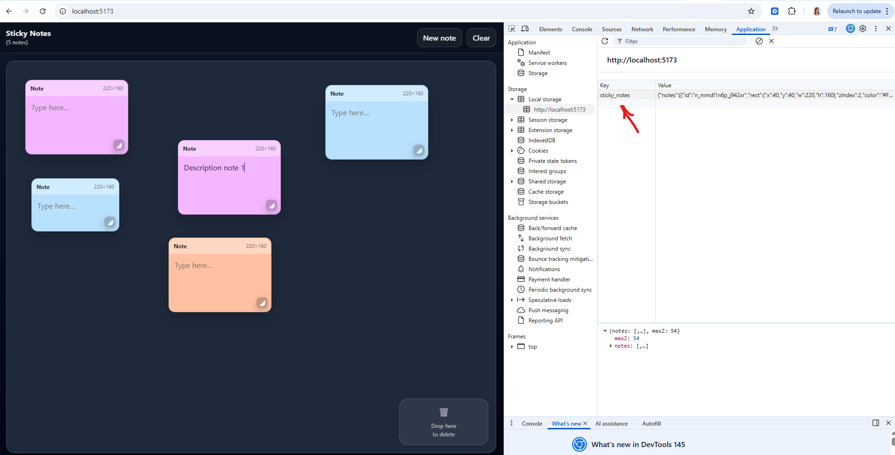
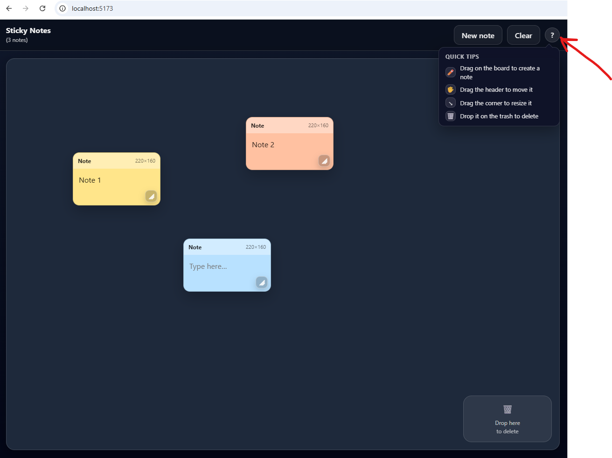
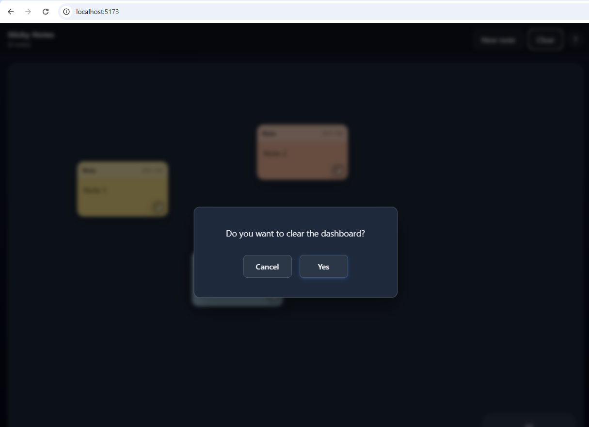

# Sticky Notes

A modern web application for creating, managing, and organizing sticky notes with a drag-and-drop interface built with React, TypeScript, and Vite.

**GitHub Repository**: [https://github.com/aleduran2/sticky-notes](https://github.com/aleduran2/sticky-notes)

## Features

- ✏️ **Create Notes**: Drag on the board to create new notes with custom sizes
- 🖐️ **Drag & Move**: Click and drag the header to move notes around
- ↘️ **Resize**: Drag the corner handle to resize notes
- 🗑️ **Delete**: Drop notes on the trash zone to delete them
- 💾 **Persistent Storage**: All notes are automatically saved to browser localStorage
- 🎨 **Color Coded**: Notes are automatically assigned different colors
- 📐 **Responsive**: Works seamlessly on different screen sizes
- 🛡️ **Error Resilience**: Error Boundary catches and handles runtime errors gracefully
- ⌨️ **Keyboard Shortcuts**: Ctrl+N to create new notes
- 📋 **Confirmation Dialogs**: User-friendly confirmation for destructive actions

## Screenshot



*Main interface - Sticky notes board with drag and drop functionality*



*Help icon showing quick tips and keyboard shortcuts*



*Confirmation dialog for clearing all notes - User-friendly confirmation before destructive actions*

## Installation

### Prerequisites

- Node.js 20.19+ or 22.12+
- npm or yarn

### Setup

1. **Clone the repository**
```bash
git clone https://github.com/aleduran2/sticky-notes.git
cd sticky-notes
```

2. **Install dependencies**
```bash
npm install
```

3. **Start development server**
```bash
npm run dev
```

The application will be available at `http://localhost:5173/` (or the next available port)

4. **Build for production**
```bash
npm run build
```

5. **Run tests**
```bash
npm test
```

## Project Structure

```
src/
├── app/              # Main application component
├── ui/               # Reusable UI components
│   ├── Board.tsx     # Main canvas for notes
│   ├── NoteView.tsx  # Individual note component
│   ├── Toolbar.tsx   # Toolbar with actions
│   ├── TrashZone.tsx # Delete zone
│   ├── ConfirmDialog.tsx # Confirmation modal
│   └── ErrorBoundary.tsx # Error boundary wrapper
├── domain/           # Core business logic
│   ├── types.ts      # TypeScript type definitions
│   ├── reducer.ts    # State management reducer
│   └── geometry.ts   # Geometry utilities
├── infra/            # Infrastructure layer
│   └── storage.ts    # LocalStorage persistence
├── config/           # Configuration
│   └── constants.ts  # Application constants
├── constants/        # Text constants
│   └── text.ts       # UI text strings
├── hooks/            # Custom React hooks
└── tests/            # Test files
```

## Architecture

### State Management

The application uses **React's built-in `useReducer` hook** for state management, eliminating the need for external libraries like Redux. The core state is defined in the `NotesState` type, which contains an array of notes and a `maxZ` property for tracking z-index ordering. All note operations (create, update, delete, bring to front) are dispatched as actions to the `notesReducer`, providing a single source of truth and predictable state transitions. This architecture scales well for the application's needs while keeping the codebase lightweight and maintainable.

### UI Architecture

The UI is built with a clear **separation of concerns**: the `Board` component manages the canvas area and handles creation of new notes through drag interactions, while individual `NoteView` components manage their own dragging, resizing, and text editing. The component hierarchy uses callback props to communicate with parent components, ensuring unidirectional data flow. Each note is rendered independently, optimized for rendering performance, and manages transient UI state (like visual transforms during dragging) separately from persisted state.

### Persistence Layer

The `storage.ts` module provides an abstraction layer for browser localStorage, with automatic JSON serialization and error handling. State changes are persisted automatically through a `useEffect` hook in the main App component, ensuring that any modifications to notes are instantly saved. The storage layer validates deserialized data to prevent corruption and gracefully handles errors when localStorage is unavailable, making the application resilient to storage failures.

### Error Handling

The application implements a **React Error Boundary** (`ErrorBoundary.tsx`) that wraps the entire application at the root level. This component catches any JavaScript errors that occur in child components, preventing the entire application from crashing. When an error is caught, a user-friendly error page is displayed with a "Refresh Page" button. In development mode, error details are shown for debugging purposes. This ensures a graceful degradation of the application even when unexpected errors occur.

## Technologies Used

- **React 18+**: UI framework with hooks
- **TypeScript**: Type-safe development
- **Vite**: Fast build tool and development server
- **Vitest**: Unit testing framework
- **CSS3**: Styling with flexbox and transforms for smooth interactions

## Testing

The project includes comprehensive test suites:

- **geometry.test.ts**: Tests for geometric calculations (normalization, sizing, intersection)
- **reducer.test.ts**: Tests for state management logic (note creation, updates, deletion)
- **storage.test.ts**: Tests for persistence layer (save, load, error handling)

Run tests with: `npm test`

## Browser Support

Works in all modern browsers that support:
- ES2020+
- localStorage API
- CSS Grid & Flexbox
- Pointer Events API

## Performance Optimizations

- Uses `useMemo` for expensive computations
- CSS transforms for smooth 60fps dragging/resizing
- Efficient re-rendering with key-based lists
- Debounced localStorage writes

